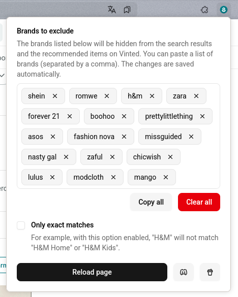

# Fast Fashion Begone
### Browser extension for excluding selected brands from Vinted

This browser browser extension aims to filter out specified brands from Vinted in search results and the recommended items section.

  

### Installation

#### Firefox (& Zen)
For Firefox, the extension can be added from Firefox Browser Add-Ons under this link: [https://addons.mozilla.org/en-GB/firefox/addon/fast-fashion-begone/](https://addons.mozilla.org/en-GB/firefox/addon/fast-fashion-begone/).

#### Chrome (& Edge, Opera, Brave, Vivaldi, Chromium, etc.)
1. Download the [`dist_chrome.zip` file from the latest release](https://github.com/sometimesdigital/fast-fashion-begone/releases).
2. Unpack the downloaded `.zip` archive.
3. Go to `chrome://extensions/` in the browser URL bar and toggle the developer mode on.
4. Click “Load unpacked” and upload the `chrome` subfolder.
5. Click on the extension button next to the URL bar and specify the brands that you don't want to see.

### Community
Feel free to join [the Discord community](https://discord.gg/PquukD7S) :)

### Known issues
If Vinted changes its layout, this extension will likely break. In that case, please let me know by opening an issue in this repository or send me an e-mail at dominika[at]sometimes.digital. You can also contact me on Discord.

### Privacy
No data is sent or collected. When the page loads, the items get hidden.
